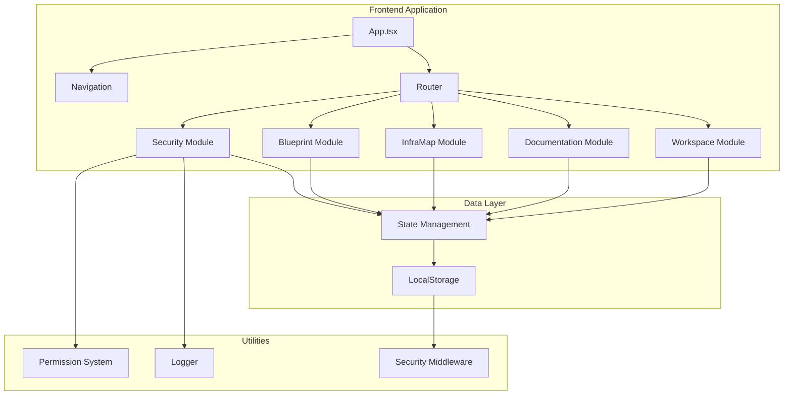
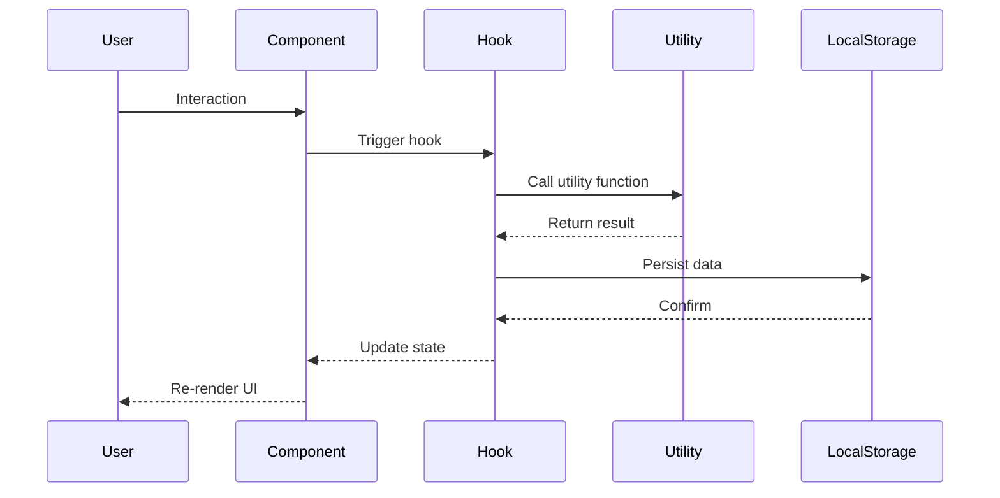
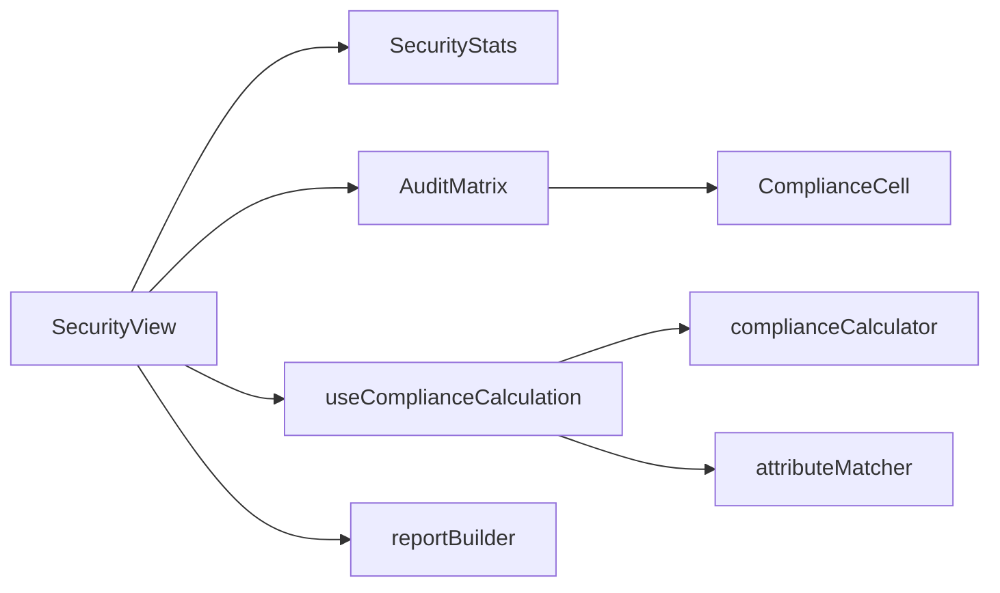
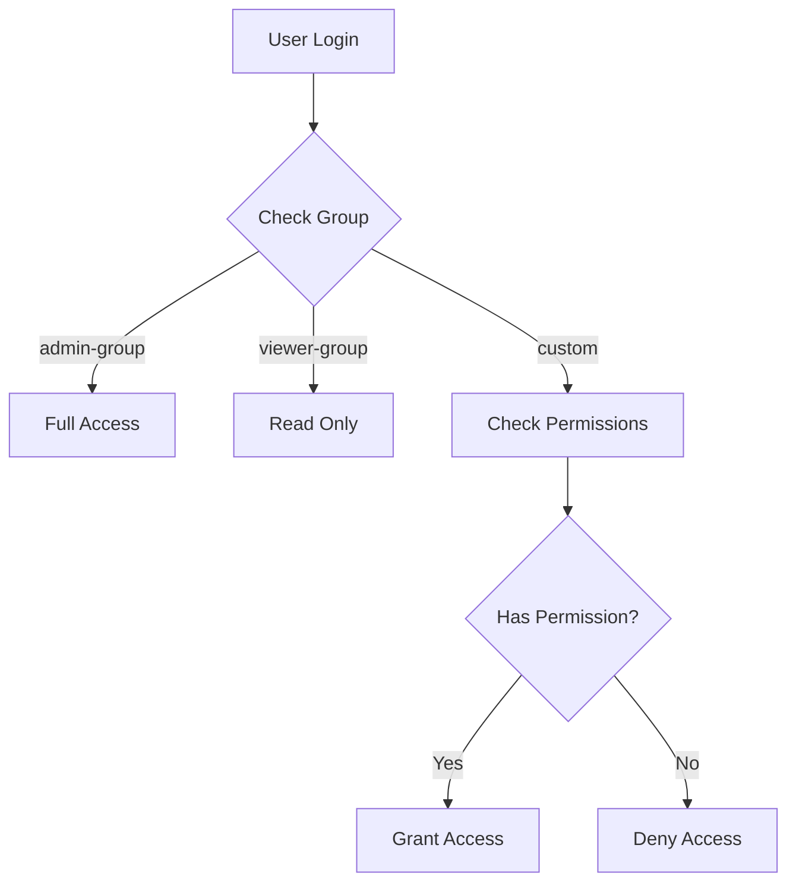
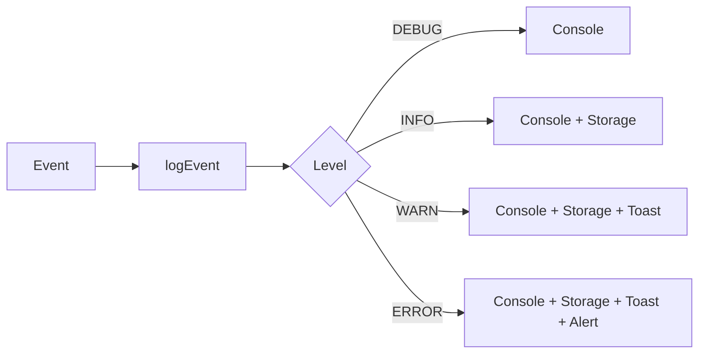
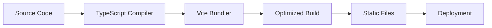

# System Architecture

## Overview

The Infrastructure Documentation System follows a modular, component-based architecture designed for maintainability, scalability, and clear separation of concerns.

## High-Level Architecture



## Module Architecture

Each module follows a consistent internal structure:

```
module/
├── components/     # React UI components
├── hooks/          # Custom React hooks for state/logic
├── utils/          # Pure utility functions
└── types/          # TypeScript type definitions
```

### Design Principles

1. **Separation of Concerns**
   - UI components focus on presentation
   - Hooks manage state and side effects
   - Utils handle pure logic and calculations

2. **Type Safety**
   - All modules have TypeScript type definitions
   - Strict typing enforced throughout

3. **Reusability**
   - Common components in `modules/common/`
   - Shared utilities accessible across modules

4. **Testability**
   - Pure functions in utils are easily testable
   - Hooks can be tested independently
   - Components receive props for flexibility

## Data Flow



## Security Module Architecture



### Component Hierarchy

- **SecurityView** (Container)
  - **SecurityStats** (Statistics display)
  - **AuditMatrix** (Table container)
    - **ComplianceCell** (Individual cells)
  - **AttributeCorrelationModal** (Attribute management)
  - **ReportGenerator** (Report creation)

### Data Processing Pipeline

1. **Input**: Raw JSON data from workspace
2. **Processing**: 
   - Parse and flatten node hierarchy
   - Calculate compliance using multiple strategies
   - Apply manual overrides
   - Calculate scores and risk levels
3. **Output**: Processed nodes with compliance data

## State Management

The application uses React's built-in state management:

- **useState** - Component-level state
- **useMemo** - Expensive computations
- **useEffect** - Side effects and data persistence
- **Custom Hooks** - Shared state logic

### State Flow

```typescript
// Example: Security state flow
const [overrides, setOverrides] = useState<SecurityOverrides>({});
const [auditCols, setAuditCols] = useState<AuditColumn[]>([]);

// Computed state
const processedData = useMemo(() => {
    // Process nodes with compliance calculation
    return processNodes(data, auditCols, overrides);
}, [data, auditCols, overrides]);

// Persistence
useEffect(() => {
    localStorage.setItem('overrides', JSON.stringify(overrides));
}, [overrides]);
```

## Permission System Architecture



### Permission Flow

1. User authenticates
2. System loads user's group from localStorage
3. Component checks permissions via `usePermissions` hook
4. UI adapts based on permission level

## Logging Architecture



## Build and Deployment



### Build Process

1. TypeScript compilation with type checking
2. Vite bundling and optimization
3. Asset processing (CSS, images)
4. Code splitting for performance
5. Production build output

## Performance Considerations

### Optimization Strategies

1. **Memoization**
   - Use `useMemo` for expensive calculations
   - Use `useCallback` for event handlers

2. **Code Splitting**
   - Lazy load modules
   - Dynamic imports for large components

3. **Virtualization**
   - Virtual scrolling for large lists
   - Pagination for data tables

4. **Caching**
   - LocalStorage for persistence
   - In-memory caching for frequent access

## Scalability

### Horizontal Scaling

- Modular architecture allows independent development
- New modules can be added without affecting existing ones
- Clear interfaces between modules

### Vertical Scaling

- Component extraction for reusability
- Hook extraction for shared logic
- Utility functions for common operations

## Future Architecture Enhancements

1. **Backend Integration**
   - REST API for data persistence
   - Real-time updates with WebSockets
   - Authentication service

2. **State Management Library**
   - Consider Redux or Zustand for complex state
   - Centralized state management

3. **Testing Infrastructure**
   - Unit tests for utilities
   - Integration tests for hooks
   - E2E tests for critical flows

4. **Documentation Generation**
   - Automated API docs from TypeScript
   - Component documentation from JSDoc
   - Architecture diagrams from code

---

**Last Updated**: 2026-02-17  
**Version**: 2.2
