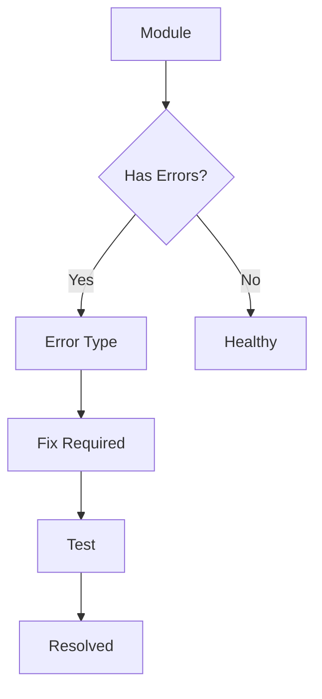

# Documentation Module

## Overview

The Documentation module provides comprehensive project documentation, module analysis, error tracking, and health monitoring.

## Features

- **Module Analysis** - Analyze all project modules with metrics
- **Error Diagrams** - Visual error flow diagrams using Mermaid
- **Health Monitoring** - Track module health and complexity
- **Permission-Based Access** - Control who can view documentation

## Components

### DocumentationView

Main documentation page with tabbed interface.

**Tabs:**
- Overview - Project summary and quick links
- Module Analysis - Detailed module metrics
- Error Analysis - Error tracking and diagrams (admin only)

### ModuleAnalysis

Displays comprehensive analysis of all modules.

**Features:**
- Overall statistics
- Per-module metrics
- Error and warning lists
- Dependency tracking

### ErrorDiagram

Visualizes error flow using Mermaid diagrams.

**Features:**
- Mermaid diagram generation
- Error severity indicators
- Fix suggestions
- Detailed error information

## Hooks

### useModuleMetrics

Analyzes modules and provides metrics.

```typescript
const { modules, isLoading, refresh } = useModuleMetrics();
```

**Returns:**
```typescript
{
    modules: ModuleMetrics[],
    isLoading: boolean,
    refresh: () => void
}
```

## Type Definitions

### ModuleMetrics

```typescript
interface ModuleMetrics {
    name: string;
    path: string;
    loc: number;              // Lines of code
    complexity: number;       // 1-10
    coverage: number;         // 0-100%
    errors: ModuleError[];
    warnings: ModuleWarning[];
    dependencies: string[];
    health: 'excellent' | 'good' | 'fair' | 'poor';
}
```

### ModuleError

```typescript
interface ModuleError {
    id: string;
    type: 'typescript' | 'runtime' | 'lint' | 'logic';
    severity: 'error' | 'warning' | 'info';
    message: string;
    file: string;
    line: number;
    column: number;
    suggestion?: string;
    fixable: boolean;
}
```

## Usage

```typescript
import { DocumentationView } from '@/modules/documentation/components/DocumentationView';

<DocumentationView currentUser={currentUser} />
```

## Permissions

- `view_documentation` - Can view documentation
- `view_error_analysis` - Can view error analysis (admin only)
- `view_module_metrics` - Can view module metrics
- `edit_documentation` - Can edit documentation

## Mermaid Diagrams

The module uses Mermaid for generating error flow diagrams:



## Future Enhancements

- [ ] Real-time error detection
- [ ] Automated fix suggestions
- [ ] Test coverage visualization
- [ ] Performance metrics
- [ ] API documentation generation
- [ ] Component documentation from JSDoc
